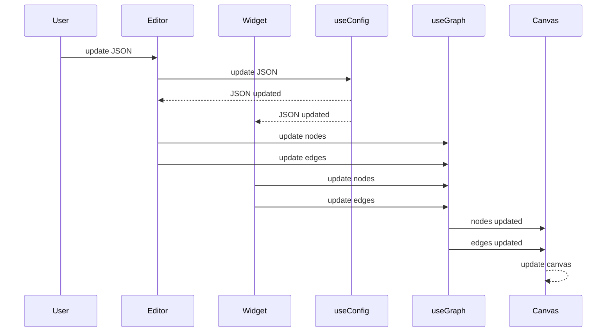

# [jsoncrack.com](jsoncrack.com) — json可视化工具


这个项目的核心功能非常清晰———JSON的可视化。虽然整体界面很像一个编辑器，左侧有很多按钮，但它们并非大型的功能模块，而是一些快捷的配置项，如导入文件、树状图的旋转等。因此（我一开始觉得）专注看看它的核心功能即可。

作为前端常用的配置文件格式，JSON结构本身是清晰好用的，但也架不住链表太长、深度太大…… 有时想把握一个JSON文件的核心结构，属实有点费眼睛。jsoncrack.com就属于这种，平时觉得没啥用，JSON文件逼疯你后疯狂全网寻找的神器。

首先，还是想来整体看看它的项目结构。

```shell
.
├── CODE_OF_CONDUCT.md
├── CONTRIBUTING.md
├── Dockerfile
├── LICENSE
├── README.md
├── default.conf
├── jest.config.ts
├── jest.setup.ts
├── next-env.d.ts
├── next.config.js
├── package.json
├── tsconfig.json
├── yarn.lock
├── public
│   └── assets
└── src
    ├── components
    │   ├── Button
    │   ├── CarbonAds
    │   ├── CustomNode
    │   ├── ErrorContainer
    │   ├── GoogleAnalytics
    │   ├── Graph
    │   ├── Input
    │   ├── Loading
    │   ├── Modal
    │   ├── MonacoEditor
    │   ├── Producthunt
    │   ├── SearchInput
    │   ├── SeoTags
    │   ├── Sidebar
    │   ├── Sponsors
    │   ├── SupportButton
    │   ├── Toggle
    │   ├── Tooltip
    │   └── __tests__
    ├── constants
    ├── containers
    │   ├── Editor
    │   │   ├── JsonEditor
    │   │   └── LiveEditor
    │   ├── Home
    │   └── Modals
    │       ├── ClearModal
    │       ├── DownloadModal
    │       ├── GoalsModal
    │       ├── ImportModal
    │       ├── NodeModal
    │       ├── SettingsModal
    │       └── ShareModal
    ├── hooks
    ├── pages
    │   ├── Editor
    │   ├── Embed
    │   └── Widget
    ├── store
    ├── typings
    └── utils
```

### iframe套娃

从这个目录，可以看出它所使用的框架也是`Next.js`，而我们从首页进入的编辑器是`src/pages/Editor`。扒拉扒拉另外两个页面，我们发现`src/pages/Embed`下还有一个这样的页面 ⬇️


是用iframe嵌入了一个演示demo用的[codepen](https://codepen.io/)页面（[地址](https://codepen.io/AykutSarac/embed/PoawZYo?default-tab=html%2Cresult)）

从源码反推，我才找到从首页到`/embed`页面的方法：首页 ——— 正中间 “GO TO EDITOR” ——— 左侧工具栏 “Share” ——— “Learn How to Embed”。（无聊的游戏🥱 但很精神👴）

更有趣的是另外一个页面：`scr/page/Widget`。

~~因为它打不开。~~

因为你已经见过它了，只是你还不知道！

就在你已经划过了的那个首页！


它是一个被iframe嵌入的迷你demo！

其实你可以先尝试在浏览器输入它的地址 https://jsoncrack.com/widget ，然后发现我也没有说错，因为确实打不开———它会重定向到首页———且不是因为“走错了”、“404”。

第一，这个地址真的存在。

第二，事实证明，走错了长这样：


看看代码：
```jsx
function inIframe() {
  try {
    return window.self !== window.top;
  } catch (e) {
    return true;
  }
}
// ...
if (!inIframe()) push("/");
```

果不其然哈。

判断是否被嵌入`iframe`的方法 +1。

有趣，俩页面，一个iframe嵌别人，一个被iframe嵌哈，正常人确实是找不着哈。

### css in js ?!

还是回到核心功能。

一进来就给孩子看傻眼了：
```tsx
export const StyledEditorWrapper = styled.div`
  width: 100%;
  height: 100%;
  overflow: hidden;
`;
```
这是个什么用法？（自问自答）这是一个叫[`styled-components`](https://styled-components.com/)的库。这是一个最小demo：
```tsx
import styled from 'styled-components'
// ...
const Button = styled.button``
```

其主要操作呢，是在`styled.button`后的\`\`中，添加所需要的css样式，就可以返回好看的组件。除了`width`、`height`这种普通的样式外，还支持css选择器，同时，也可以用`${}`内的函数返回一些动态的样式 ⬇️

```tsx
import styled, { css } from 'styled-components'

const Button = styled.button`
  background: transparent;
  border-radius: 3px;
  border: 2px solid palevioletred;
  color: palevioletred;
  margin: 0 1em;
  padding: 0.25em 1em;

  ${props =>
    props.primary &&
    css`
      background: palevioletred;
      color: white;
    `};
`
```

又是一个有趣的css打开方式。和昨天**能不写就不写的语义化css**完全相反，这是一个典型的`css in js`的写法。这一思想可以很好的避免传统css造成的样式污染问题，也让样式的维护和数据一样方便集中，但也造成了较大的“冗余”，实际上如今这样的打开方式似乎不是主流。

### 漂亮的模块封装 📦

```tsx
const EditorPage: React.FC = () => {
  return (
    <StyledEditorWrapper>
      <Head>
        <title>Editor | JSON Crack</title>
        <meta
          name="description"
          content="View your JSON data in graphs instantly."
        />
      </Head>
      <StyledPageWrapper>
        <Sidebar />
        <StyledEditorWrapper>
          <Panes />
        </StyledEditorWrapper>
      </StyledPageWrapper>
    </StyledEditorWrapper>
  );
};

export default EditorPage;
```

作为核心页面的主要代码，真是让人赏心悦目。回忆一下这个页面的结构 ⬇️

再看看上面那段代码 ⬆️

再继续往下读 ⬇️


是不是让你冷静冷静现场不用修BUG好像都蠢蠢欲动立马想好从哪里开刀了？（bushi

没错是的，就是这么漂亮，好想拉一刀。

这样的项目得加多少功能才能改成💩呢？

（开个玩笑）

---

核心功能值得一看的无非两处：左边的JSON文本编辑器，和右边的画布。

### `Monaco` 编辑器

本项目中的编辑器使用的是开源的[`@monaco-editor/react`](https://github.com/react-monaco-editor/react-monaco-editor)，另外做了一个加载错误的兜底，当`Monaco`抛出异常时进行提示。根据本项目的使用体验来说，`Monaco`编辑器还是很好用的。

```tsx
export const JsonEditor: React.FC = () => {
  const [hasError, setHasError] = React.useState(false);

  return (
    <StyledEditorWrapper>
      <ErrorContainer hasError={hasError} />
      <MonacoEditor setHasError={setHasError} />
    </StyledEditorWrapper>
  );
};
```

至于编辑器内部的逻辑，这次先不细看了，但是可以挖个坑给这个大坑，下次一定。

### `reaflow` 画布绘制

本项目中画布的基础功能还是比较完善的：如缩放、移动、自适应、触摸板手势、导出图片等，操作体验也很流畅。另外，也有一些交互动效：如节点和边的hover效果、节点点击事件（边目前没有点击事件）。其中节点也分为了两个区域：


节点主体（展示对象信息或类型为列表的字段名）和右侧子节点展开按钮。

当节点为对象时，只展示节点主体，而对象中列表类型的字段则会被处理为对象节点的下级节点。列表字段的节点则包含节点主体和子节点展开收起按钮，可以控制子节点的显示或隐藏。

整个画布的底层绘制依赖于[`reaflow`](https://reaflow.dev/)，其使用非常便捷。

> REAFLOW is a modular diagram engine for build static or interactive editors. The library is feature rich and modular allowing for displaying complex visualizations with total customizability.
> 
> 谷歌翻译：REAFLOW 是用于构建静态或交互式编辑器的模块化图表引擎。该库功能丰富且模块化，允许显示具有完全可定制性的复杂可视化。

可以看一个demo，这也是本项目中使用`reaflow`的方法。

```
import React from 'react';
import { Canvas } from 'reaflow';

const nodes = [
  {
    id: '1',
    text: '1'
  },
  {
    id: '2',
    text: '2'
  }
];

const edges = [
  {
    id: '1-2',
    from: '1',
    to: '2'
  }
];

export const MyDiagram = () => (
  <Canvas
    nodes={nodes}
    edges={edges}
  />
);
```

绘制结果：


当然，并非所有的画布能力都由它提供。尽管`reaflow`中有缩放方法，但本项目中禁用了它，选择了[`react-zoom-pan-pinch`](https://prc5.github.io/react-zoom-pan-pinch)包提供的缩放能力。

### `Storybook` 组件框架

有趣的是，`reaflow`和`react-zoom-pan-pinch`的文档都是使用[`Storybook`](https://storybook.js.org/)搭建的。

> Storybook is a frontend workshop for building UI components and pages in isolation. Thousands of teams use it for UI development, testing, and documentation. It’s open source and free.
> 
> 谷歌翻译：Storybook 是一个前端工作室，用于单独构建 UI 组件和页面。数以千计的团队使用它进行 UI 开发、测试和文档编制。它是开源且免费的。

通过`Storybook`，可以进行UI组件的开发、测试、文档编写（几乎是全方位了），是“组件驱动开发”的重要工具。同类工具中，还有[`Docz`](https://www.docz.site/)、[`React Styleguidist`](https://react-styleguidist.js.org/)、`UMI`构建体系下的[`dumi`](https://d.umijs.org/)等。就笔者个人而言，因为工作原因，对`dumi`的使用会相对更多。

`Storybook`在其中应该算是“全能大哥大型”了。它有着75K+Star，支持多种技术栈，社区活跃，文档接口丰富…… 大型的项目很是值得一试，至于小项目的体量是否能承受它的学习成本就不一定啦。

### 数据管理

上面只是个题外话。

回到我们的核心页面。左边的编辑器也看过了，右边的画布渲染也瞧过了，那二者之间的数据是如何解析和传递的呢？

答案也很简单：`zustand`。

##### `zustand` 状态管理

`redux`看太多了，有点不太认识其他的状态管理工具了。

> A small, fast and scalable bearbones state-management solution using simplified flux principles. Has a comfy api based on hooks, isn't boilerplatey or opinionated.
> 
> Don't disregard it because it's cute. It has quite the claws, lots of time was spent to deal with common pitfalls, like the dreaded [zombie child problem](https://react-redux.js.org/api/hooks#stale-props-and-zombie-children), [react concurrency](https://github.com/bvaughn/rfcs/blob/useMutableSource/text/0000-use-mutable-source.md), and [context loss](https://github.com/facebook/react/issues/13332) between mixed renderers. It may be the one state-manager in the React space that gets all of these right.
> 
> ---
> 
> 使用简化的通量原理的小型、快速和可扩展的 bearbones 状态管理解决方案。 有一个基于hooks的舒适api，不是样板文件或固执己见。
> 
> 不要因为它可爱而忽视它。 它有很多爪子，花了很多时间来处理常见的陷阱，比如可怕的僵尸子问题、反应并发和混合渲染器之间的上下文丢失。 它可能是 React 空间中的唯一状态管理器，可以正确处理所有这些问题。

[`zustand`](https://github.com/pmndrs/zustand)基于hooks使用，看起来使用体验比`redux`要轻量不少。

```tsx
import create from 'zustand'

const useBearStore = create((set) => ({
  bears: 0,
  increasePopulation: () => set((state) => ({ bears: state.bears + 1 })),
  removeAllBears: () => set({ bears: 0 }),
}))
```

的确，看看官方给出的优于`redux`的理由，就会发现轻量就是原因之一：

> Why zustand over redux?
> -   Simple and un-opinionated
> -   Makes hooks the primary means of consuming state
> -   Doesn't wrap your app in context providers
> -   [Can inform components transiently (without causing render)](https://github.com/pmndrs/zustand#transient-updates-for-often-occurring-state-changes)
> 
> ---
> 
> 为什么 zustand 而不是 redux？
> - 简单而不固执己见
> - 使钩子成为消费状态的主要方式
> - 不将您的应用包装在上下文提供程序中
> - [可以瞬时通知组件（不会导致渲染）](https://github.com/pmndrs/zustand#transient-updates-for-often-occurring-state-changes)

##### 数据流

项目中共有三个状态文件：
```shell
src/store
├── useConfig.tsx
├── useGraph.tsx
└── useStored.tsx
```

从核心数据流来看，`useConfig`中存储了用户输入的`json`数据、`useGraph`中存储了`nodes`和`edges`数据、`useStored`则与此无关。

用户输入的数据通过`json`编辑器组件更新到`useConfig`中的`json`。

从`json`到`nodes`和`edges`，则是在`json`编辑器组件和`widget`组件（昨天说到的iframe小窗模式，此时没有`json`编辑器）中，对`useConfig`中`json`的变化实时监听，并更新到`useGraph`中的`nodes`和`edges`。而这一过程的数据处理逻辑则单独封装在`src/utils/jsonParser`的`parse`方法中，具体实现还是有些复杂，300+行代码，感兴趣可以自己扒拉看一看。

最后，简单用时序图画了一下这个过程。



这就是本项目核心功能的数据流啦，顺便复习一下时序图吧！（大雾）

---

小小的开源项目，简单的页面，简单的语言，还是有不少宝藏可挖挖的！

今天就看到这里，赶紧`✨Star`明天继续！
